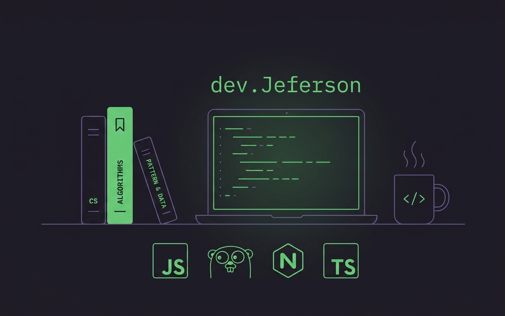

  

  Backend Developer en formación | Estudiante de Ingeniería en Sistemas de la Información

---

### 🚀 Sobre mí

- 🎓 Estudiante de **Ingeniería en Sistemas de la Información** (último año)
- 🔭 Enfocado principalmente en **desarrollo Backend**
- 🌱 Aprendiendo y explorando **Go** y profundizando en **Java**
- 💻 También me muevo en **frontend** con React + Vite cuando el proyecto lo requiere
- 📚 Aprendo de forma autodidacta: investigo, pruebo y construyo proyectos por mi cuenta
- 🤝 Abierto a colaborar en proyectos de backend o fullstack

---

### 🛠️ Tech Stack

**Lenguajes**

**Backend / Runtime**

**Frontend**

**Bases de Datos**

---

### 📊 GitHub Stats

  
  

  

---

### 📫 Contacto

<!-- Agrega aquí tus enlaces reales, por ejemplo: -->

  <!--  -->
  <!--  -->

---

<i>Construyendo, aprendiendo y equivocándome en el proceso 🚀</i>
